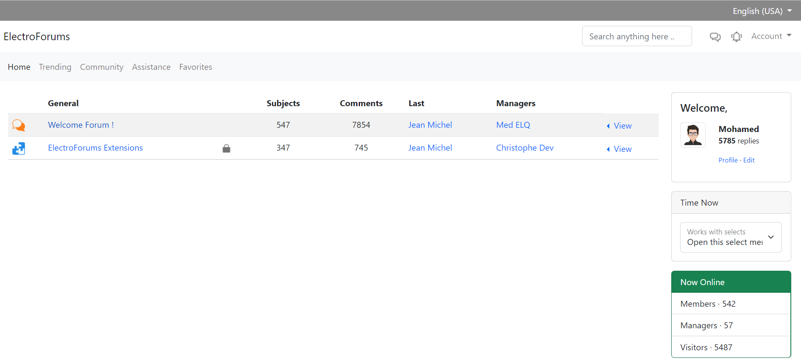
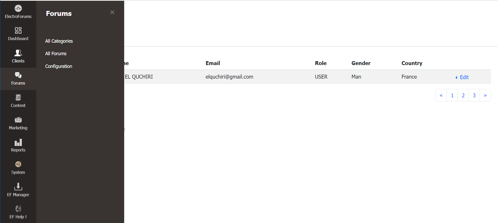

# ElectroForums &copy;

Integrate Easy & Efficient CMS System

## Deployment

Please note that ElectroForums CMS Project is under development

[]()

## Installation

To install ElectroForums project run :

```bash
  git clone git@github.com:elquchiri/electroforums.git
  composer install
  
  Edit .env file to match your database
  DATABASE_URL="mysql://root:@127.0.0.1:3306/electroforums?serverVersion=8&charset=utf8mb4"
  
  php bin/console make:migration
  php bin/console doctrine:migrations:migrate
  bin/console assets:install
```


## Features & CMS Philosophy

- Strong Authentication and Roles System
- Improved Content Manager and Editor System
- Improved And Full Control Page Views
- Marketing System
- Modular / Extensible System
- Centralized Configuration System
- Multi Website / Language System
- ElectroForums Manager for Extensions
- Advanced Reporting System
- Strong Administration Dashboard
- Themes System


## Demo

Frontend Home Page



Backend Dashboard



## Contribution

- To contribute to ElectroForums, please feel free to send PRs Requests on this repository.
- Please feel free to email me on [elquchiri@gmail.com](mailto:elquchiri@gmail.com) for suggestions
- Please Join our Channels on Slack & Telegram
   - http://join.slack.com/t/electroforumscms/shared_invite/zt-1qbsdh8sw-_rFQJsEI4qAbdhorYz4RWQ
   - https://t.me/electroforums

## Donation

Your donation will help, Improve and Speed up productivity of The Amazing ElectroForums CMS.

[](https://www.buymeacoffee.com/elquchiriw?new=1)
