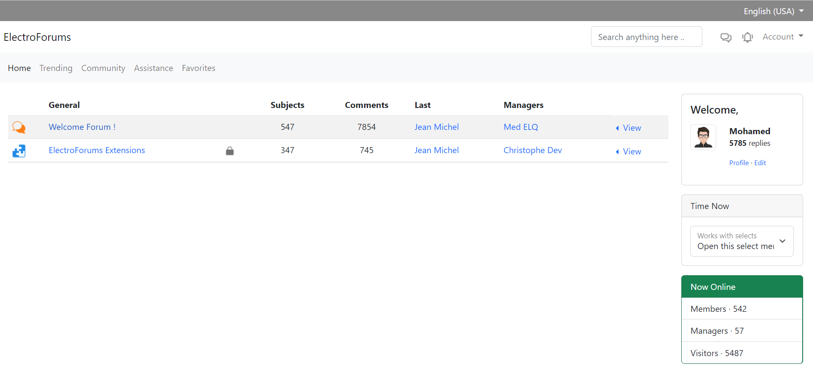
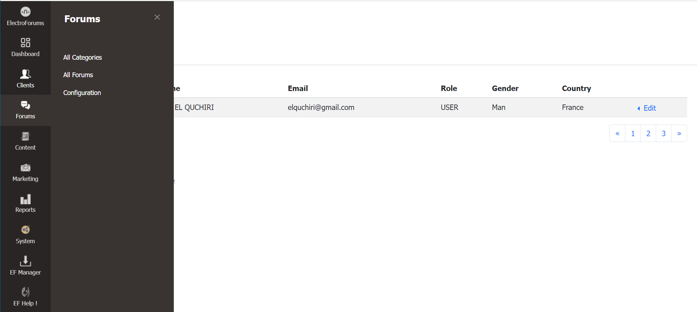

# ElectroForums &copy;

Integrate Easy & Efficient Forums System

[](https://www.buymeacoffee.com/elquchiriw?new=1)


## Installation

To install ElectroForums project run :

```bash
  git clone git@github.com:elquchiri/electroforums.git
  composer install
  bin/console assets:install
```


## Features & CMS Philosophy

- Strong Authentication and Roles System
- Improved Content Manager and Editor System
- Improved And Full Control Page Views
- Marketing System
- Modular System
- Centralized Configuration System
- Multi Website / Language System
- ElectroForums Manager for Extensions


## Demo

Frontend Home Page



Backend Dashboard



## Contribution

- To contribute to ElectroForums, please feel free to send PRs Requests on this repository.
- Please feel free to email me on [elquchiri@gmail.com](mailto:elquchiri@gmail.com) for suggestions