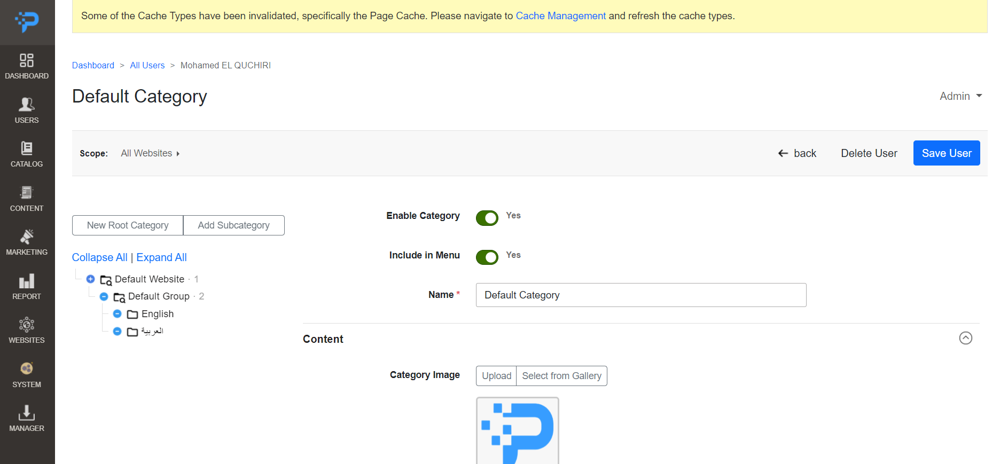
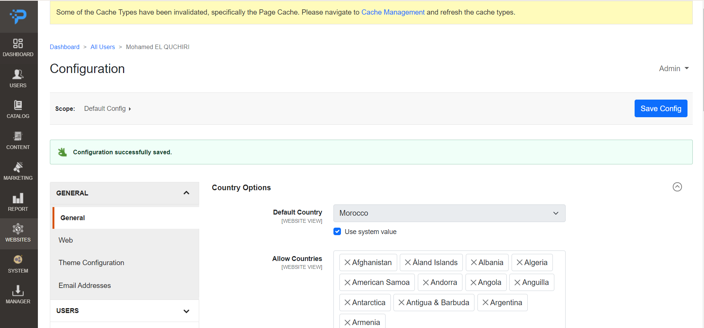

<b>Stay informed of developments on:</b>
<p>
<a href="https://t.me/programcms"></a>
<a href="http://join.slack.com/t/programcms/shared_invite/zt-1qbsdh8sw-_rFQJsEI4qAbdhorYz4RWQ"></a>
<a href="https://www.startimes.com/f.aspx?t=38856528"></a>
</p>
<p></p>

ProgramCMS provides you with a complete, trustworthy CMS & easy to use PHP Framework to build and deploy All kind of Web Sites.

Written in PHP, on top of Symfony, it makes it very easy to reuse, install or create new bundles to Improve your Application.

The Manager Bundle deliver & Maintain ProgramCMS Bundles, so you can add to your Website, with ease, any kind of features and modules which fit the best with your application's needs.

## Deployment


Please note that ProgramCMS Project is under development

## Requirements

- Apache 2 or Nginx
- PHP 8.1
- MySQL 8
- Node
- Redis
- Composer 2
- Git
## Installation

To install ProgramCMS project run :

```bash
  git clone git@github.com:elquchiri/programcms.git
  composer install
  
  Edit .env file to match your database
  DATABASE_URL="mysql://root:@127.0.0.1:3306/programcms?serverVersion=8&charset=utf8mb4"
  
  php bin/pcms make:migration
  php bin/pcms doctrine:migrations:migrate
  php bin/pcms setup:data-patch
  php bin/pcms assets:compile
```


## Features & CMS Philosophy

- Strong Authentication and Roles System
- Improved Content Manager and Editor System
- Improved And Full Control Page Views
- Marketing System
- Modular / Extensible System
- Centralized Configuration System
- Multi Website / Language System
- ProgramCms Manager for Extensions
- Advanced Reporting System
- Strong Administration Dashboard
- Automatic Routing System based on Controller Path
- Themes System
- Full RTL Support (Thanks to Mohammad Younes for <a href="https://rtlcss.com/index.html">RTLCSS</a>)
- Layouts, Containers, Blocks and Templates Engine
- Aspect-Oriented Programming Style
- Data Based AI to process, generate and translate content

## Demo

Backend Demo :

- Admin Panel


- Website Manager


- Catalog Categories


- Centralized Configuration



Frontend Home Page :


## Contribution

- To contribute to ProgramCMS, please feel free to send PRs Requests on this repository.
- Please feel free to email me on [elquchiri@gmail.com](mailto:elquchiri@gmail.com) for suggestions
- Please Join our Channels on Slack & Telegram
   - http://join.slack.com/t/programcms/shared_invite/zt-1qbsdh8sw-_rFQJsEI4qAbdhorYz4RWQ
   - https://t.me/programcms

## Remarkable Changes

- 2022/12: First commit in the project
- 2023/06: Changing Project name from ElectroForums to ProgramCMS
- 2023/08: Finally, The Inspiring Logo (°P) Founded
## Donation

Your donation will help, Improve and Speed up productivity of The Amazing ProgramCMS.

[](https://www.buymeacoffee.com/elquchiriw?new=1)

<p align="center">


</p>
