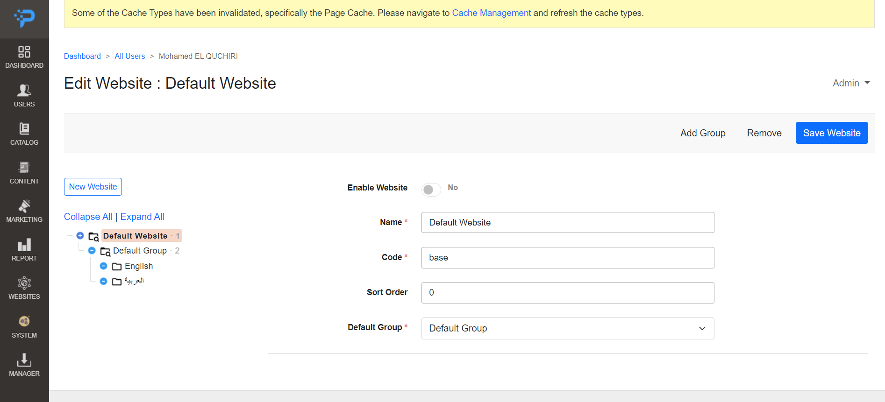

<b>Stay informed of developments on:</b>
<p>
<a href="https://t.me/programcms"></a>
<a href="http://join.slack.com/t/programcms/shared_invite/zt-1qbsdh8sw-_rFQJsEI4qAbdhorYz4RWQ"></a>
<a href="https://www.startimes.com/f.aspx?t=38856528"></a>
</p>
<p></p>

ProgramCMS is designed with simplicity, performance and usability in mind. It works efficiently across all major desktop and mobile platforms, can be extended with lots of plugins, has a beautiful, easy to use and well-documented API and a simple, readable source code that is a joy to contribute to.
It provides you with a complete, trustworthy CMS & easy to use PHP Framework to build and deploy All kind of Web Sites.

The Manager Bundle deliver & Maintain ProgramCMS Bundles, so you can add to your Website, with ease, any kind of features and modules which fit the best with your application's needs.

## Deployment


Please note that ProgramCMS Project is under development

## Requirements

- Apache 2 or Nginx
- PHP 8.1
- MySQL 8
- Node 20.11
- Redis
- Composer 2

## Installation

First, Make sure to have all requirements installed on your OS.

Next somewhere in your hard drive, create your root project folder.

Then inside your folder, run :

```bash
  git clone git@github.com:elquchiri/programcms.git
  composer install
```

Edit .env file to match your database :
```bash
  DATABASE_URL="mysql://root:@127.0.0.1:3306/programcms?serverVersion=8&charset=utf8mb4"
```

Finally, run :
```bash
  php bin/pcms make:migration
  php bin/pcms doctrine:migrations:migrate
  php bin/pcms theme:upgrade
  php bin/pcms setup:data-patch
  php bin/pcms assets:compile
  php bin/pcms admin:create admin@email.com admin123
```


## Features & CMS Philosophy

- Multi Website Support
- Users System with an Advanced Roles & ACL Support
- Advanced Content and Page Builder Editor
- Marketing System
-  Url Rewriting & SEO-Friendly System
- Modular / Extensible System
- Centralized Configuration System
- ProgramCMS Manager for Extensions
- Advanced Reporting System
- Strong Administration Dashboard
- Automatic Routing System based on Controller Path
- Themes System
- Native RTL Support (Thanks to Mohammad Younes for <a href="https://rtlcss.com/index.html">RTLCSS</a>)
- Layouts, Containers, Blocks and Templates Engine
- Full UI Components System
- Strong & Full Customizable EAV System
- Dependency Injection & Aspect-Oriented Programming Support
- Data Based AI to process, generate and translate content
- Advanced Email Templates Builder
- Advanced Text Chat System
- Advanced Live Customer Service

And much much more ..
## Frontend Libraries
| Library   | Type     | Description                |
| :-------- | :------- | :------------------------- |
| Stimulus | `Framework` |  |
| Select2 | `Library` |  |
| Interact | `Library` |  |
| GrapesJS | `Library` |  |
| Socket.io | `Library` |  |

## Demo

Backend Demo :

- Admin Panel


- Website Manager



- Catalog Categories


- Centralized Configuration


- Email & Newsletter Builder


- i18n Dashboard AR:


- Page Builder


Basic Frontend Home Page :


## Contribution

- To contribute to ProgramCMS, please feel free to send PRs Requests on this repository.
- Please feel free to email me on [elquchiri@gmail.com](mailto:elquchiri@gmail.com) for suggestions
- Please Join our Channels on Slack & Telegram
   - http://join.slack.com/t/programcms/shared_invite/zt-1qbsdh8sw-_rFQJsEI4qAbdhorYz4RWQ
   - https://t.me/programcms

## Remarkable Changes

- 2022/12: First commit in the project.
- 2023/06: Changing Project name from ElectroForums to ProgramCMS.
- 2023/08: Finally, The Inspiring Logo (°P) Founded.
- 2024/04: First stable beta version for internal use.
- 2025/04: Switching from Twig to Yaml for layout management
## Donation

Your donation will help, Improve and Speed up productivity of The Amazing ProgramCMS.

[](https://www.buymeacoffee.com/elquchiriw?new=1)

<p align="center">


</p>