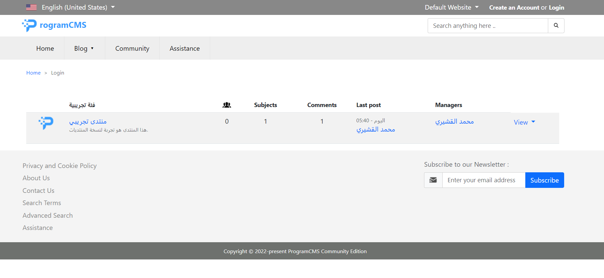

<p align="center">
<a href="https://t.me/electroforums"></a>
<a href="http://join.slack.com/t/electroforumscms/shared_invite/zt-1qbsdh8sw-_rFQJsEI4qAbdhorYz4RWQ"></a>

</p>

ElectroForums provides you with a complete, trustworthy CMS & easy to use PHP Framework to build and deploy All kind of Web Sites.

Written in PHP, on top of Symfony, it makes it very easy to reuse, install or create new bundles to Improve your Application.

The EFManager deliver & Maintain ElectroForums Bundles, so you can choose any kind of features and modules wich fit the best with your application's requirements to add to your Website with ease.

## Deployment


Please note that ElectroForums CMS Project is under development

## Installation

To install ElectroForums project run :

```bash
  git clone git@github.com:elquchiri/electroforums.git
  composer install
  
  Edit .env file to match your database
  DATABASE_URL="mysql://root:@127.0.0.1:3306/electroforums?serverVersion=8&charset=utf8mb4"
  
  php bin/console make:migration
  php bin/console doctrine:migrations:migrate
  bin/console assets:install
```


## Features & CMS Philosophy

- Strong Authentication and Roles System
- Improved Content Manager and Editor System
- Improved And Full Control Page Views
- Marketing System
- Modular / Extensible System
- Centralized Configuration System
- Multi Website / Language System
- ElectroForums Manager for Extensions
- Advanced Reporting System
- Strong Administration Dashboard
- Automatic Routing System
- Themes System


## Demo

Frontend Home Page



Backend Dashboard


## Contribution

- To contribute to ElectroForums, please feel free to send PRs Requests on this repository.
- Please feel free to email me on [elquchiri@gmail.com](mailto:elquchiri@gmail.com) for suggestions
- Please Join our Channels on Slack & Telegram
   - http://join.slack.com/t/electroforumscms/shared_invite/zt-1qbsdh8sw-_rFQJsEI4qAbdhorYz4RWQ
   - https://t.me/electroforums

## Donation

Your donation will help, Improve and Speed up productivity of The Amazing ElectroForums CMS.

[](https://www.buymeacoffee.com/elquchiriw?new=1)
